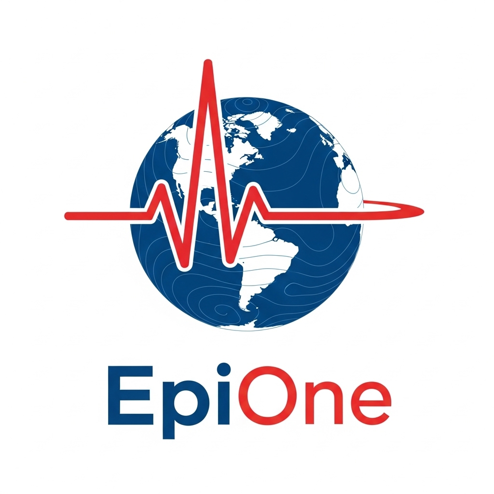

## 🚩 Badges
<!-- Badges: update the URLs as needed -->


<div align="center">
  
</div>

# EpiOne — Epidemiological Dashboard & Reporting  
*Unified health surveillance, reporting, and epidemiological insights.*

> 🚧 Work in progress (WIP): Minimum Viable Product demo with iterative updates implemented. Interfaces and APIs may change.

EpiOne enables humanitarian and public health programs to monitor disease trends, generate epidemiological reports, and explore health data through an interactive dashboard — all from a single, modular codebase. Originally developed for International Medical Corps (IMC) health facilities, it supports DHIS2 line lists, DHIS2 aggregate data, or Excel aggregate data. The code is based on the R programming language and the project was created using R Studio Version 2025.05.1+513 and Visual Studio Code Version 1.96.4 (Universal).

Our vision is for EpiOne to be easily configurable across different settings, countries, and levels of health system maturity. Currently, it works best with line list data; aggregate data can be loaded with some code tweaks. Work is ongoing to make aggregate data handling more automated, and at present some manual adjustments are still required.

## ✨ Key Features
- **Shiny App Interactive Dashboard:** Explore consultations by time, place, and disease with fast filters.
- **R Markdown Automated Reports:** Generate comprehensive epidemiological HTML reports with QA and ICD‑11 context.
- **Taxonomy Support:** Custom IMC and WHO-aligned disease taxonomies for consistent classification.
- **AI Integration:** Optional AI summaries and EpiBot chatbot for enhanced insights.

## 📸 Visual Examples
Below are example screenshots and demos of EpiOne in action: (Coming soon)

**Dashboard Demo**


**Automated Report Demo**


## 🧪 Synthetic Data (for demo & testing)
EpiOne ships with a synthetic data mode so you can run the dashboard and the R Markdown report. Real data is never shared publicly and is not used in this repository.

## ⚡ Quick Start
Run the dashboard:
```r
shiny::runApp("app")
```
Render a report (example):
```r
rmarkdown::render("reports/epi_report.Rmd", params = list(country_code = "synthetic"))
```
First-time setup (optional):
```r
source("scripts/install_requirements.R")
```
For full setup and synthetic data options, see [Quick Start Docs](docs/quick_start.md).

## 📊 Data Requirements
Minimum fields: `datevisit`, `morbidity`, `orgunit`. Recommended: `sex`, `age/age_group`, `admin1`, `admin2`.  
Detailed column recognition and data formatting guidance are available in [Data Requirements Docs](docs/data_requirements.md).

## 🧾 Disease Taxonomy
EpiOne uses two complementary taxonomies: an IMC canonical taxonomy for program-aligned classification, and WHO ICD‑11 mapping for standards-based coding drawn from the official API. See [Taxonomy Docs](taxonomy/README_Taxonomy.md) for details.

## ✅ Data Quality & Column Recognition
Ensure essential fields are present and parseable. Recommended fields improve visualizations. For comprehensive quality checks and column mapping examples, refer to [Data Quality Docs](docs/data_quality.md).

## 🗂️ Project Structure
```text
epi-one/
├── app/                    # Dashboard app components
├── modules/                # Feature modules
├── R/                      # Analysis helpers and loaders
├── reports/                # R Markdown reports
├── taxonomy/               # Disease taxonomies and ICD‑11 integration
├── config/                 # Configuration files
├── data/                   # Local cache, dictionaries, shapefiles
└── docs/                   # Documentation and guides
```

## 🤖 AI-Enabled Insights (Optional)
Minimal config to enable AI summaries and EpiBot chatbot:
```yaml
default:
  ai_features:
    enabled: yes
    summary_generation:
      enabled: yes
  epibot_features:
    enabled: yes
```
See `ai_customization.yml` and [EpiBot Docs](docs/epibot.md) for setup and privacy considerations.

> 🛠️ **Local AI** – Run <code>ollama serve</code> (or your preferred self-hosted LLM) and update <code>config/config.yml</code> with the model name.

## 📦 Modules Overview

| Module                          | Purpose                                | Docs                               |
|--------------------------------|--------------------------------------|-----------------------------------|
| `app/`                         | Shiny app shell and runtime           | `app/README.md`                   |
| `modules/mod_geographic.R`     | Geography and maps                    | `modules/mod_geographic/README.md`|
| `modules/mod_disease_surveillance.R` | Disease surveillance views           | `modules/mod_disease_surveillance/README.md` |
| `modules/mod_time_trends.R`    | Temporal analytics                    | `modules/mod_time_trends/README.md`|
| `modules/mod_epibot.R`         | EpiBot chatbot                       | `docs/epibot.md`                   |
| `reports/epi_report.Rmd`       | Full epidemiological report          | `reports/README.md`                |
| `taxonomy/`                    | ICD‑11 mapping and base taxonomy     | `taxonomy/README_Taxonomy.md`     |

## 🤝 Contributing & Support
Issues and PRs welcome. See module READMEs for coding style and boundaries. For questions or collaborations, please open an issue.

## 🌍 Partnerships & Data Sharing
To explore a data sharing agreement with IMC for research or co-development, please reach out to research@internationalmedicalcorps.org.
